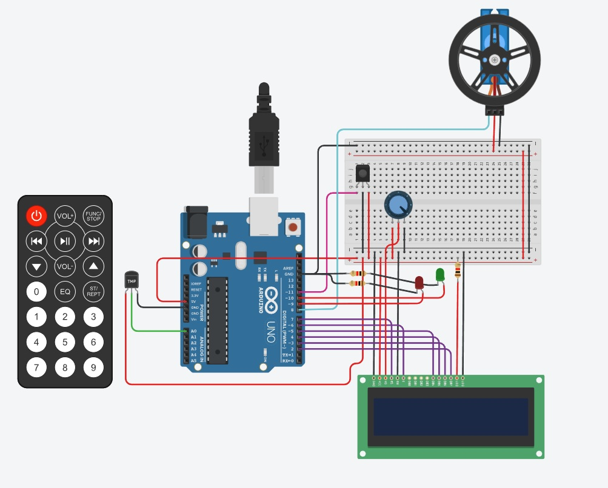

# SEGUNDO PARCIAL SPD

## :innocent: ALUMNO
- Uriel Nicolas Marles

## :sunglasses: Descripción
En este proyecto realizamos un sensor de temperatura que esta asociado a un control remoto que permite encenderlo y apagarlo. En caso de que la temperatura sea muy alta, se detecta un incendio y se inicia un motor que seria la respuesta al incendio.

## Codigo Completo
Aqui el codigo completo 

~~~ C (lenguaje en el que esta escrito)
#include <IRremote.h>
#include <LiquidCrystal.h>
#include <Servo.h>

#define infrarrojo 11
#define temperatura A0
#define verde 10
#define rojo 9
#define ENCENDIDO 0xFF00BF00
#define FAVORITO 3910582016

float temperaturaAnterior;
float temperaturaActual = 10;
int pantallaPrendida = 0;
int favorito = 0;

LiquidCrystal lcd(7, 6, 5, 4, 3, 2);
Servo servo;

void setup()
{
  Serial.begin(9600);
  lcd.begin(16, 2);
  IrReceiver.begin(infrarrojo, DISABLE_LED_FEEDBACK);
}

void loop()
{
  CodigoBoton();
  temperaturaAnterior = temperaturaActual;
  ActualizarTemperatura();
  if (pantallaPrendida == 1)
  {
    digitalWrite(verde,HIGH);
     if (temperaturaAnterior != temperaturaActual)
    {
      servo.detach();
      lcd.clear();
      lcd.setCursor(1, 0);
      lcd.print("Grados:");
      lcd.print(temperaturaActual);
      lcd.print(" C");
      lcd.setCursor(0,1);
      if (temperaturaActual < 20)
      {
        lcd.print("Invierno");
      }else if(temperaturaActual < 30){
        lcd.print("Otonio");
      }else if(temperaturaActual < 40){
        lcd.print("Primavera");
      }else if(temperaturaActual < 60){
        lcd.print("Verano");
      }else{
        lcd.print("INCENCDIOOO");
        servo.attach(8);
        servo.write(180);
      }
    }
  }
  else{
    digitalWrite(verde,LOW);
    servo.detach();
    lcd.clear();
  }
}

void ActualizarTemperatura()
{
  int valor_del_sensor = analogRead(temperatura);
  temperaturaActual = map(valor_del_sensor,20,358,-40,125);
}

void CodigoBoton()
{
   if (IrReceiver.decode())
 {
     Serial.println(IrReceiver.decodedIRData.decodedRawData);
     if (IrReceiver.decodedIRData.decodedRawData == ENCENDIDO)
     {
       if (pantallaPrendida == 1){
         pantallaPrendida = 0;
       }else{
         pantallaPrendida = 1;
         temperaturaActual = 10;
       }
     }
     if(IrReceiver.decodedIRData.decodedRawData == FAVORITO)
     {
       if (favorito == 1){
         favorito = 0;
         digitalWrite(rojo,LOW);
       }else{
         favorito = 1;
         digitalWrite(rojo,HIGH);
       }
     }
    IrReceiver.resume();
 }
}
~~~

---
### Links
- [Link al proyecto](https://www.tinkercad.com/things/1lhiMsgpw3g-urielmarlesparcial2/editel?sharecode=3FgeZg1o49HyM2X8le240eNVXbdCXSU94oSwAiaKVVg).

---

